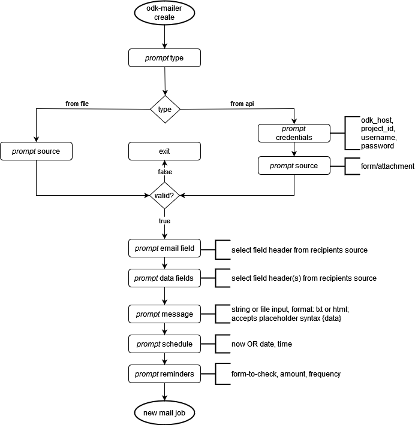

# ODK Mailer

A simple CLI to send Mails for ODK.
Built with Typer and packaged with Poetry.

## Requirements
- Python 3
- PIP

## Setup
**Install the cli via pip**
```bash
pip install odk-mailer
```

**Configuration example**
Config location: `~/.odk-mailer/config.json`:
```json
{
        "smtp_host": "smtp.freesmtpservers.com",
        "smtp_port": "25",
        "smtp_user": "optional",
        "smtp_pass": "optional",

        "odk_host":"https://your.odk-central.host.tld",
}
```

## Usage
**Create and run a new mail job**
```bash
    # Create a new mail job with a unique ID
    odk-mailer create

    # Run the job by ID
    odk-mailer run <job-id>
```

**List mail jobs and evaluate them**
```bash
    # Show all jobs
    odk-mailer list

    # Run all jobs that are ready to be sent
    odk-mailer evaluate
```

## CLI Design
### Create


## Features > commands

create a mail job
- [x] Read a recipients CSV list, validate input
- [x] Define field from available headers to be used for email sending, validate email addresses
- [x] Read message content from stdin 
- [x] Support data templating with format
- [ ] Read message content from file
- [ ] Add reminders for a mail task, using ODK API, http-lib
- [ ] Send mail manually or schedule for the future; smtp, python-crontab


list mail jobs
- [x] Show available mail tasks (that are stored in the local db)

delete mail jobs
- [x] delete mail job by id


<!-- show queue:
- [ ] see upcoming mail jobs

show logs
- [ ] see past mail jobs by status -->

check connection
- [ ] give instant feedback about connectivity to SMTP and API endpoints

## Development
Building a Package - Guide: https://typer.tiangolo.com/tutorial/package/#create-your-app

**Requirements**
- Python 3.10
- Poetry 1.7

```bash
    # clone the repo and cd into
    poetry shell
    poetry install
    # Run it with
    poetry run odk-mailer 
```

**Push to PyPi**

```
    poetry build
    poetry publish
    # requires credentials to be setup: poetry config pypi-token.pypi <my-token>
```